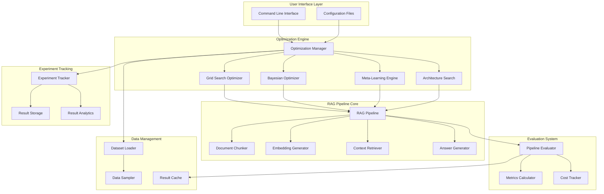

# Design Document

## Overview

AutoRAG is designed as a modular, extensible system for automatically optimizing RAG pipeline configurations. The architecture follows a plugin-based approach where each component (chunking, embedding, retrieval, generation) can be swapped independently. The system progresses through four phases: basic grid search, Bayesian optimization, meta-learning, and architecture search, with each phase building upon the previous one's infrastructure.

The core innovation lies in treating RAG optimization as a multi-objective optimization problem, using machine learning techniques to efficiently explore the configuration space while considering accuracy, cost, and latency trade-offs.

## Architecture

### High-Level System Architecture



### Component Architecture

The system follows a layered architecture with clear separation of concerns:

1. **Interface Layer**: CLI and configuration management
2. **Optimization Layer**: Different optimization strategies
3. **Pipeline Layer**: Modular RAG components
4. **Evaluation Layer**: Metrics and cost tracking
5. **Data Layer**: Dataset management and caching
6. **Persistence Layer**: Experiment tracking and storage

## Components and Interfaces

### Core RAG Pipeline

```python
class RAGPipeline:
    """Main pipeline orchestrating all RAG components."""
    
    def __init__(self, config: PipelineConfig):
        self.config = config
        self.chunker = ComponentFactory.create_chunker(config.chunking)
        self.embedder = ComponentFactory.create_embedder(config.embedding)
        self.retriever = ComponentFactory.create_retriever(config.retrieval)
        self.generator = ComponentFactory.create_generator(config.generation)
        self.cost_tracker = CostTracker()
    
    def index(self, documents: List[Document]) -> None:
        """Index documents for retrieval."""
        
    def query(self, question: str, top_k: int = 5) -> Answer:
        """Generate answer for question using RAG."""
        
    def get_metrics(self) -> PipelineMetrics:
        """Get current pipeline performance metrics."""
```

### Component Factory Pattern

```python
class ComponentFactory:
    """Factory for creating RAG components based on configuration."""
    
    @staticmethod
    def create_chunker(config: ChunkingConfig) -> DocumentChunker:
        chunker_map = {
            'fixed': FixedSizeChunker,
            'semantic': SemanticChunker,
            'sliding': SlidingWindowChunker
        }
        return chunker_map[config.strategy](config)
    
    @staticmethod
    def create_embedder(config: EmbeddingConfig) -> EmbeddingGenerator:
        embedder_map = {
            'ada-002': OpenAIEmbedder,
            'e5-small-v2': HuggingFaceEmbedder,
            'bge-small-en': BGEEmbedder
        }
        return embedder_map[config.model](config)
```

### Optimization Engine Interface

```python
class BaseOptimizer(ABC):
    """Abstract base class for all optimization strategies."""
    
    @abstractmethod
    def optimize(self, dataset: Dataset, search_space: SearchSpace, 
                budget: OptimizationBudget) -> OptimizationResult:
        """Find optimal configuration within budget constraints."""
        
    @abstractmethod
    def suggest_next_config(self) -> PipelineConfig:
        """Suggest next configuration to evaluate."""
        
    def evaluate_config(self, config: PipelineConfig, dataset: Dataset) -> ConfigResult:
        """Evaluate a single configuration."""
```

### Evaluation System

```python
class PipelineEvaluator:
    """Comprehensive evaluation of RAG pipeline performance."""
    
    def __init__(self, metrics_config: MetricsConfig):
        self.accuracy_calculator = AccuracyCalculator(metrics_config.accuracy)
        self.relevance_calculator = RelevanceCalculator(metrics_config.relevance)
        self.latency_tracker = LatencyTracker()
        self.cost_tracker = CostTracker(metrics_config.cost)
    
    def evaluate(self, pipeline: RAGPipeline, test_set: TestSet, 
                progressive: bool = False) -> EvaluationResult:
        """Evaluate pipeline on test set with optional progressive evaluation."""
        
    def calculate_composite_score(self, metrics: Dict[str, float], 
                                weights: Dict[str, float]) -> float:
        """Calculate weighted composite score for multi-objective optimization."""
```

### Configuration Management

```python
@dataclass
class PipelineConfig:
    """Complete configuration for RAG pipeline."""
    chunking: ChunkingConfig
    embedding: EmbeddingConfig
    retrieval: RetrievalConfig
    generation: GenerationConfig
    
    def validate(self) -> List[ValidationError]:
        """Validate configuration completeness and consistency."""
        
    def to_dict(self) -> Dict[str, Any]:
        """Serialize configuration to dictionary."""
        
    @classmethod
    def from_dict(cls, config_dict: Dict[str, Any]) -> 'PipelineConfig':
        """Deserialize configuration from dictionary."""

@dataclass
class SearchSpace:
    """Defines the space of possible configurations to explore."""
    chunking_strategies: List[str]
    chunk_sizes: List[int]
    chunk_overlaps: List[int]
    embedding_models: List[str]
    retrieval_methods: List[str]
    retrieval_top_k: List[int]
    generation_models: List[str]
    generation_temperatures: List[float]
    
    def generate_configs(self, strategy: str = 'grid') -> Iterator[PipelineConfig]:
        """Generate configurations according to specified strategy."""
```

## Data Models

### Core Data Structures

```python
@dataclass
class Document:
    """Represents a document in the knowledge base."""
    id: str
    content: str
    metadata: Dict[str, Any]
    source: Optional[str] = None
    
@dataclass
class DocumentChunk:
    """Represents a chunk of a document."""
    id: str
    document_id: str
    content: str
    start_pos: int
    end_pos: int
    metadata: Dict[str, Any]

@dataclass
class Query:
    """Represents a user query."""
    id: str
    text: str
    expected_answer: Optional[str] = None
    relevant_docs: Optional[List[str]] = None
    metadata: Dict[str, Any] = field(default_factory=dict)

@dataclass
class Answer:
    """Represents a generated answer."""
    text: str
    confidence: float
    contexts: List[DocumentChunk]
    generation_metadata: Dict[str, Any]
    cost: float
    latency: float
```

### Evaluation Data Models

```python
@dataclass
class EvaluationMetrics:
    """Comprehensive metrics for pipeline evaluation."""
    accuracy: float
    relevance: float
    latency: float
    cost: float
    throughput: float
    
    def composite_score(self, weights: Dict[str, float]) -> float:
        """Calculate weighted composite score."""
        
@dataclass
class ConfigResult:
    """Result of evaluating a single configuration."""
    config: PipelineConfig
    metrics: EvaluationMetrics
    individual_results: List[QueryResult]
    evaluation_time: float
    error: Optional[str] = None

@dataclass
class OptimizationResult:
    """Result of complete optimization run."""
    best_config: PipelineConfig
    best_metrics: EvaluationMetrics
    all_results: List[ConfigResult]
    optimization_history: List[Dict[str, Any]]
    total_time: float
    total_cost: float
```

### Experiment Tracking Models

```python
@dataclass
class ExperimentRun:
    """Represents a complete optimization experiment."""
    id: str
    timestamp: datetime
    dataset_info: DatasetInfo
    search_space: SearchSpace
    optimization_strategy: str
    budget: OptimizationBudget
    results: OptimizationResult
    system_info: Dict[str, Any]
    
@dataclass
class DatasetInfo:
    """Information about the dataset used for optimization."""
    name: str
    size: int
    domain: str
    characteristics: Dict[str, Any]  # avg_doc_length, vocab_size, etc.
```

## Error Handling

### Error Hierarchy

```python
class AutoRAGError(Exception):
    """Base exception for AutoRAG system."""
    pass

class ConfigurationError(AutoRAGError):
    """Raised when configuration is invalid."""
    pass

class EvaluationError(AutoRAGError):
    """Raised when evaluation fails."""
    pass

class OptimizationError(AutoRAGError):
    """Raised when optimization process fails."""
    pass

class ResourceError(AutoRAGError):
    """Raised when system resources are exhausted."""
    pass

class APIError(AutoRAGError):
    """Raised when external API calls fail."""
    pass
```

### Error Recovery Strategies

```python
class ErrorHandler:
    """Centralized error handling and recovery."""
    
    def __init__(self, config: ErrorHandlingConfig):
        self.retry_config = config.retry
        self.fallback_config = config.fallback
        self.checkpoint_config = config.checkpoint
    
    def handle_api_error(self, error: APIError, context: Dict[str, Any]) -> Any:
        """Handle API errors with exponential backoff retry."""
        
    def handle_evaluation_error(self, error: EvaluationError, 
                              config: PipelineConfig) -> Optional[ConfigResult]:
        """Handle evaluation errors with graceful degradation."""
        
    def create_checkpoint(self, optimization_state: Dict[str, Any]) -> str:
        """Create checkpoint for recovery."""
        
    def restore_from_checkpoint(self, checkpoint_id: str) -> Dict[str, Any]:
        """Restore optimization state from checkpoint."""
```

### Retry Logic

```python
class RetryManager:
    """Manages retry logic for various operations."""
    
    def __init__(self, max_retries: int = 3, base_delay: float = 1.0):
        self.max_retries = max_retries
        self.base_delay = base_delay
    
    def retry_with_backoff(self, func: Callable, *args, **kwargs) -> Any:
        """Execute function with exponential backoff retry."""
        
    def is_retryable_error(self, error: Exception) -> bool:
        """Determine if error is worth retrying."""
```

## Testing Strategy

### Unit Testing Approach

```python
class TestRAGPipeline(unittest.TestCase):
    """Unit tests for RAG pipeline components."""
    
    def setUp(self):
        self.test_config = PipelineConfig(
            chunking=ChunkingConfig(strategy='fixed', size=256),
            embedding=EmbeddingConfig(model='mock-embedder'),
            retrieval=RetrievalConfig(method='dense', top_k=5),
            generation=GenerationConfig(model='mock-generator')
        )
        self.mock_documents = [Document(id='1', content='Test document')]
    
    def test_pipeline_initialization(self):
        """Test pipeline creates all components correctly."""
        
    def test_document_indexing(self):
        """Test document indexing workflow."""
        
    def test_query_processing(self):
        """Test query processing and answer generation."""
        
    def test_error_handling(self):
        """Test pipeline handles errors gracefully."""

class TestOptimizers(unittest.TestCase):
    """Unit tests for optimization algorithms."""
    
    def test_grid_search_completeness(self):
        """Test grid search explores all configurations."""
        
    def test_bayesian_convergence(self):
        """Test Bayesian optimizer converges to good solutions."""
        
    def test_early_stopping(self):
        """Test early stopping saves computational resources."""
```

### Integration Testing

```python
class TestEndToEndOptimization(unittest.TestCase):
    """Integration tests for complete optimization workflows."""
    
    def test_complete_grid_search(self):
        """Test complete grid search optimization."""
        
    def test_bayesian_optimization_workflow(self):
        """Test Bayesian optimization from start to finish."""
        
    def test_cost_budget_enforcement(self):
        """Test optimization respects cost budgets."""
        
    def test_checkpoint_recovery(self):
        """Test optimization can recover from interruptions."""

class TestDatasetIntegration(unittest.TestCase):
    """Integration tests with real datasets."""
    
    def test_msmarco_loading(self):
        """Test MS MARCO dataset loading and processing."""
        
    def test_evaluation_accuracy(self):
        """Test evaluation metrics match expected values."""
```

### Performance Testing

```python
class TestPerformance(unittest.TestCase):
    """Performance and scalability tests."""
    
    def test_large_dataset_handling(self):
        """Test system handles large datasets efficiently."""
        
    def test_memory_usage(self):
        """Test memory usage stays within acceptable bounds."""
        
    def test_concurrent_evaluations(self):
        """Test system can handle concurrent evaluations."""
```

### Mock Components for Testing

```python
class MockEmbedder(EmbeddingGenerator):
    """Mock embedder for testing without API calls."""
    
    def embed(self, texts: List[str]) -> np.ndarray:
        return np.random.rand(len(texts), 384)
    
    def embed_query(self, query: str) -> np.ndarray:
        return np.random.rand(384)

class MockGenerator(AnswerGenerator):
    """Mock generator for testing without API calls."""
    
    def generate(self, query: str, contexts: List[str]) -> Answer:
        return Answer(
            text=f"Mock answer for: {query}",
            confidence=0.8,
            contexts=[],
            generation_metadata={},
            cost=0.01,
            latency=0.1
        )
```

## Implementation Phases

### Phase 1: Core Infrastructure (Weeks 1-4)

**Components to Implement:**
- Basic RAG pipeline with swappable components
- Configuration management system
- Simple evaluation metrics
- Grid search optimizer
- Basic experiment tracking

**Key Deliverables:**
- Working end-to-end pipeline
- Evaluation on MS MARCO subset
- Grid search over 20+ configurations
- CSV/JSON result storage

### Phase 2: Intelligent Optimization (Weeks 5-8)

**Components to Implement:**
- Bayesian optimization with Gaussian Processes
- Multi-objective optimization
- Progressive evaluation and early stopping
- Enhanced cost tracking

**Key Deliverables:**
- 5x faster optimization than grid search
- Multi-objective trade-off analysis
- Cost-aware optimization

### Phase 3: Meta-Learning (Weeks 9-12)

**Components to Implement:**
- Dataset characterization
- Configuration prediction from dataset features
- Knowledge base for storing past experiments
- Transfer learning between datasets

**Key Deliverables:**
- 50% reduction in optimization time for new datasets
- Automated dataset analysis
- Cross-dataset performance validation

### Phase 4: Architecture Search (Weeks 13-16)

**Components to Implement:**
- Extended architecture search space
- Evolutionary algorithms for architecture discovery
- Novel architecture patterns (iterative refinement, multi-stage retrieval)
- Architecture interpretability tools

**Key Deliverables:**
- Discovery of novel architectures
- Consistent improvements over standard RAG
- Interpretable architecture explanations

## Security and Privacy Considerations

### Data Privacy
- All document processing happens locally
- No sensitive data sent to external APIs without explicit consent
- Configurable data anonymization for cloud-based models

### API Security
- Secure storage of API keys using environment variables
- Rate limiting to prevent API abuse
- Cost monitoring to prevent unexpected charges

### Experiment Security
- Secure storage of experiment results
- Access control for sensitive experiments
- Audit logging for all optimization runs

## Performance Optimization

### Caching Strategy
```python
class ResultCache:
    """Multi-level caching for optimization results."""
    
    def __init__(self, config: CacheConfig):
        self.embedding_cache = EmbeddingCache(config.embedding)
        self.evaluation_cache = EvaluationCache(config.evaluation)
        self.config_cache = ConfigCache(config.config)
    
    def get_cached_result(self, config: PipelineConfig, 
                         dataset_hash: str) -> Optional[ConfigResult]:
        """Retrieve cached evaluation result."""
        
    def cache_result(self, config: PipelineConfig, dataset_hash: str, 
                    result: ConfigResult) -> None:
        """Cache evaluation result for future use."""
```

### Parallel Processing
```python
class ParallelEvaluator:
    """Parallel evaluation of multiple configurations."""
    
    def __init__(self, max_workers: int = 4):
        self.max_workers = max_workers
        self.executor = ThreadPoolExecutor(max_workers=max_workers)
    
    def evaluate_batch(self, configs: List[PipelineConfig], 
                      dataset: Dataset) -> List[ConfigResult]:
        """Evaluate multiple configurations in parallel."""
```

### Memory Management
```python
class MemoryManager:
    """Manages memory usage during optimization."""
    
    def __init__(self, max_memory_gb: float = 8.0):
        self.max_memory = max_memory_gb * 1024**3
        self.current_usage = 0
    
    def check_memory_usage(self) -> bool:
        """Check if memory usage is within limits."""
        
    def cleanup_unused_objects(self) -> None:
        """Clean up unused objects to free memory."""
```

This design provides a solid foundation for implementing the AutoRAG optimization system with clear interfaces, comprehensive error handling, and a scalable architecture that can evolve through the planned phases.